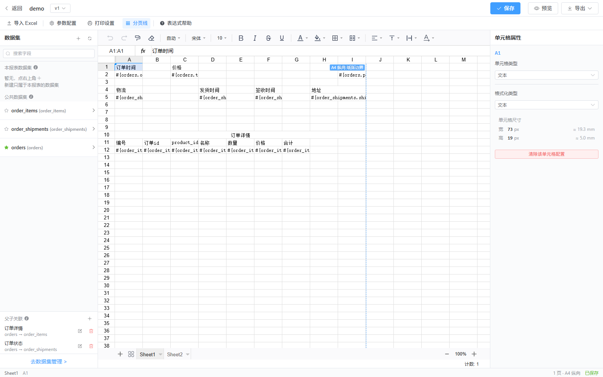
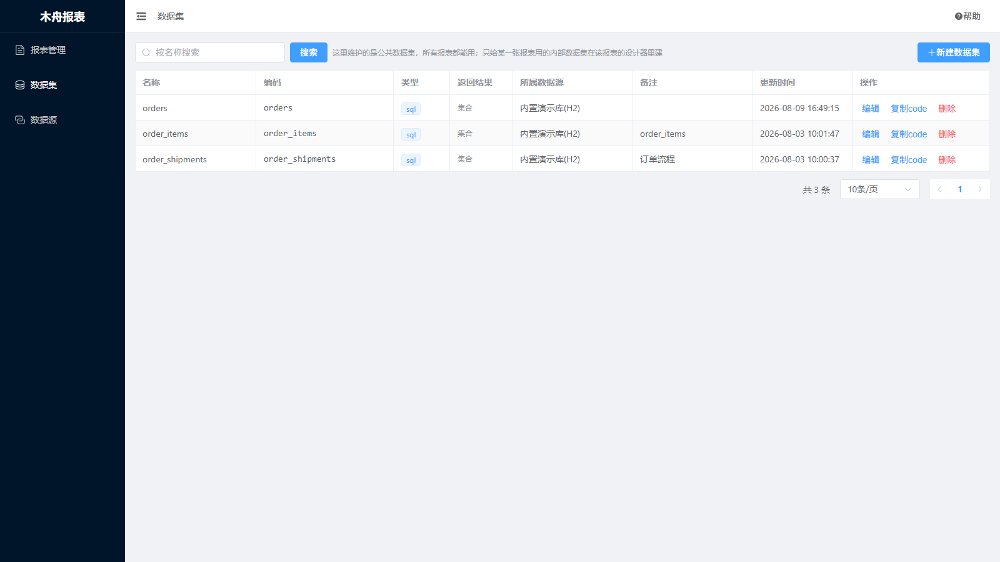

# 木舟报表 · MuZhou Report

[](LICENSE)
[](https://github.com/x157123/muzhou-report/actions/workflows/ci.yml)
[](https://adoptium.net/)
[](https://nodejs.org/)

一个开箱即用的**拖拽式报表设计器**。
用 Excel 一样的方式设计报表：把数据集字段拖到单元格里，运行时自动按行扩展、分组合并、聚合计算，并可导出 Excel / PDF / Word。

**Apache-2.0 许可**：个人与公司都可免费使用、修改、商用与闭源分发，无需付费或授权。

```
Vue 3 + Vite + Pinia + FortuneSheet + vuedraggable
        ↕  REST (/api)
Spring Boot 3 + MyBatis-Plus + Aviator + Dynamic-Datasource
```

---

## 长什么样

**报表设计器** —— 左边拖字段，中间像 Excel 一样排版，右边配这个格子怎么取数；
画布上那条虚线是按当前打印设置算出来的**纸张边界**，所见即所打。



**数据集** —— SQL / HTTP API / 静态 JSON 三种取数方式，一键解析字段、预览数据；
公共数据集所有报表都能用，内部数据集只属于某一张报表、随它一起复制和删除，
还能再收窄到**只属于某一个报表版本**（不同版本接口不一样时用得上）。



---

## 功能

| 模块 | 能力 |
|---|---|
| **数据源** | 多数据库（MySQL / PostgreSQL / Oracle / SQL Server / H2）运行时动态注册与切换、连接测试、表与字段元数据浏览 |
| **数据集** | SQL / HTTP API / 静态 JSON 三种类型；`${param}` 安全参数绑定（JDBC 占位符）、`$!{param}` 白名单拼接；一键解析字段、数据预览；三种作用范围：**公共**（数据集管理页建，所有报表可用）、**报表级**（设计器里建，本报表每一版都能用，随报表一起删除/复制）、**版本级**（只属于当前这一版，随版本一起复制/删除）。解析时由窄到宽，所以某一版想换个接口，建一个**同编码**的版本级数据集把上层盖住即可，模板里的绑定一个字都不用改；返回结果可标为**集合**或**分页**（分页型自动识别数据数组与总数字段） |
| **设计器** | FortuneSheet 提供的 Excel 内核（合并、样式、公式、多 Sheet）；左侧字段拖拽落格；右侧单元格属性面板（扩展方向 / 分组 / 聚合 / 格式化，并显示选中单元格的宽高 px / mm）；打印设置（纸张 / 方向 / 页边距 / 缩放 / 打印区域 / 顶端标题行 / 页头页尾 / 水印）并在画布上实时显示分页线，作用范围可选「仅当前工作表」「全部工作表」「跟随报表设置」——多 Sheet 报表里宽表用 A3 横向、窄表用 A4 纵向互不影响，另有一个「工作表」页签一眼看全每张的纸张/独立设置/打印区域；开启「限制宽度」后拖动列宽不会把要打印的列撑出纸张宽度 |
| **渲染引擎** | 行带纵向扩展、横向扩展、相同值分组合并、跨行公式引用自动偏移、Aviator 表达式求值、数值/日期/货币/百分比格式化 |
| **分页** | 每张报表可指定一个**主接口**（分页型数据集），预览页据此出分页条：翻页把 `pageNo`/`pageSize` 传给它重新渲染，总页数按它自报的总数算 |
| **按数据拆单据** | 设一份模板，按主接口的数据列表**每行拆一份**，两种出口：**多 sheet 输出**（N 份拼在同一张 sheet 里，每份开头打分页符 —— Excel 里是一张连续的表，打印仍是一条一页）与**每条数据一个 sheet**（N 份各成一张工作表，单据名当表名）。单据名取该行任一字段。模板有多张时可以**按张指定谁跟着拆**，「第一张清单列表 + 每条数据一份详情」也一并覆盖。单据、工资条、成绩单这类报表设计一次即可 |
| **父子关联** | 子接口查询：先查主表，再拿主表返回的字段值逐行去查子表（左下角「父子关联」里配「子表参数 ← 主表字段」）。子表数据在模板里就是一条普通的行带，主表字段跟着子行走，主子明细一张清单直接铺出来；与「按数据拆单据」叠加就是一条主数据一张带明细的单据 |
| **参数** | **全局参数**（「参数管理」页维护，输入框 / 数字 / 日期 / 日期范围 / 下拉）：一处配好，**所有报表都能用** —— 公司抬头、打印人、当前部门这类每张报表都要的东西不必逐张声明。自动按同名透传给数据集；预览地址上的 query 参数（`/view/{id}?id=11233`）直接透传，**没声明过也能用** —— 数据集里 SQL 的 `${id}` 与接口地址的 `${id}` 都取得到，方便被门户 / iframe 嵌入 |
| **字体** | 工具栏内置一份中文字体清单；服务器上没有的字体可以**传上来**（「字体管理」页，.ttf / .otf / .ttc）。传上来之后它会出现在字体下拉里、画布上按 `@font-face` 画得出来，**导出 PDF 时字体文件会内嵌进去**，出纸就是这款字体。Excel / Word 只写得进字体名（打开文件的那台机器得装了它），要精确出纸走 PDF |
| **导入导出报表** | 报表列表页勾选若干张 → 导出成一个 `.mzreport.json` 包（报表定义 + 全部版式 + 内部数据集 + 内容里引用到的公共数据集），到另一个环境导入即可 —— 测试环境调好整包带进正式环境。包里**按编码引用不带主键**，所以跨环境不会撞 id；**数据源不进包**（口令导不出来，两个环境的连接本来就不一样），目标环境缺哪个会在结果里列出来。同编码报表可选跳过 / 覆盖（报表 id 不变，链接不断）/ 另建一张；一张失败不影响别的，逐张给结果 |
| **输出** | 在线预览（**默认就是后端出的 PDF**，页头页尾、页码、水印、分页位置都是打印时的样子，所见即所打；可一键切回表格预览滚动查看）、打印（打的就是屏幕上那份 PDF，与「导出 PDF」逐页一致）、Excel（.xlsx）导出（保留合并、样式、行高列宽，并写入页面设置与页头页尾；列宽按 Excel 的字符宽单位精确换算，开启限宽时按「一页宽」出纸，不会被切到第二页）、PDF / Word 导出（后端先出 xlsx 再转，纯 Java 不依赖 LibreOffice / MS Office，出纸与 Excel 一致，页头页尾与水印每页都画） |
| **导出文件名** | 打印设置的「导出」页签里配：**报表名 + 主接口的某几个字段值**拼成文件名（连接符可改，报表名也能关掉），一批单据导出来一眼能分清哪份是哪份。字段值取主接口第一行；取不到值的字段整段跳过，文件名里不能用的字符自动洗掉，一段都拼不出来就退回报表名 |

---

## 快速开始

前置：**JDK 21+**、**Node 18+**、**Maven 3.9+**。

### 1. 后端

```bash
cd backend
mvn spring-boot:run
```

启动即用 —— 默认使用内嵌 H2 文件库（`backend/data/muzhoureport.mv.db`），首次启动会自动建表并写入演示数据：
演示业务表 `demo_order` / `demo_product`，演示数据集 `orders` / `region_summary` / `products`，
以及两张可直接打开的演示报表「订单明细表」「区域销售汇总」。

服务地址 `http://localhost:8080`。

### 2. 前端

```bash
cd frontend
npm install
npm run dev
```

打开 `http://localhost:5173`（Vite 已配置 `/api` → `http://localhost:8080` 代理）。

### 3. 切到 MySQL（可选）

改 `backend/src/main/resources/application.yml` 的 `spring.datasource.dynamic.datasource.master`，
并把 `spring.sql.init.schema-locations` 指向你自己的 MySQL 建表脚本（`schema-h2.sql` 的语法基本通用，
需把 `CLOB` 换成 `LONGTEXT`、`MERGE INTO ... KEY(id)` 换成 `INSERT ... ON DUPLICATE KEY UPDATE`）。

---

## 五分钟做一张报表

1. **数据源** → 内置的「内置演示库(H2)」已就绪，或新建你自己的。
2. **数据集** → 新建，选数据源，写 SQL，点「解析字段」，点「数据预览」确认，保存。
   记住数据集的 **编码（code）**，单元格里用 `#{code.字段}` 引用它。
   这里建的是**公共数据集**，所有报表都能用；只给一张报表用的数据集不必来这儿建，见第 4 步。
3. **报表管理** → 新建报表 → 自动进入设计器。
4. 在设计器里：
   - 左侧数据集面板的 **＋** 可以直接建**内部数据集**（同样的 SQL/API/JSON 编辑器），
     它只出现在这张报表的字段树里，报表删除时一并删除、复制报表时一起复制。
   - 先点一个单元格作为落点，再从左侧把字段拖进来（会自动在上一格写好表头）。
   - 选中数据单元格，在右侧把 **扩展方式** 设为「纵向扩展」——这一行就变成了会随数据行数自动复制的「行带」。
   - 想要合计？在行带下面一行放同一个字段，把 **汇总方式** 设为 `SUM`，它不会跟着扩展，只输出一个聚合值。
   - 想让「区域」这种重复值纵向合并？把该单元格的 **分组方式** 设为「分组」。
5. **预览** → 看渲染结果 → **导出 Excel / PDF / Word**。

---

## 单元格表达式

| 写法 | 含义 |
|---|---|
| `#{数据集code.字段名}` | 数据单元格，按属性面板的扩展方式展开 |
| `${参数名}` | 参数替换（全局参数与报表自带的参数都走这个写法） |
| `!{SUM("B2:B10")}` | 服务端 Aviator 计算 |
| `=SUM(B2:B5)` | 原生 Excel 公式，扩展时引用自动偏移 |

Aviator 可用函数：`SUM AVG MAX MIN COUNT IF ROUND CONCAT DATEFMT NUMFMT NVL ABS PERCENT`
可用变量：`params`（报表参数）、`row`（当前扩展行数据）、`ds`（全量数据集数据）。

数据单元格可以在 `#{}` 前后接着写字：`#{orders.amount}元`、`共 #{orders.cnt} 件` ——
值按格式化设置填回 `#{}` 原来的位置，前后的字原样保留（里面还能再写 `${参数}`）。
注意这样出来的格子在 Excel 里是**文本**不是数值，要参与公式计算就别加前后缀。
字段没取到值时整格留空，不会只剩一个「元」。

### 报表分页

1. 数据集编辑里把「返回结果」设为**分页**（接口响应形如 `{records:[...], total:1280}`，
   `total/totalCount/count`、`records/rows/list/data` 这些常见字段名都能自动认出来，
   `{data:{list:[...],total:n}}` 这种嵌一层的也认）。
2. 接口地址上用 `${pageNo}` / `${pageSize}` 接页码：`/api/order?page=${pageNo}&size=${pageSize}`。
3. 在设计器左侧数据集面板点☆把它设为**主接口** —— 一张报表只能有一个，
   预览页底部就会出现分页条，翻页只影响主接口，其它数据集每页照旧全量取。

集合型数据集（默认）是整份取回，没有总数也就没有分页条。SQL 数据集恒为集合型。

### 按数据拆单据

设一份模板，按数据列表拆成 N 份（一条数据一张单据）：

1. 把要拆的数据集设为**主接口**（左侧数据集面板点 ☆），它得是**集合型**。
2. 打印设置 → **输出** 页签 → 输出方式选 **多 sheet 输出** 或 **每条数据一个 sheet**，
   再选单据名取哪个字段（留空就是「第1条」「第2条」…）。

拆分的做法两种一样：模板整份复制 N 遍（N = 主接口的行数），第 i 份只喂第 i 行数据，
**其它数据集每份都拿全量**（明细表、抬头信息照常取）。最多 200 条，超了会报错 ——
先用报表参数把数据筛小。**区别只在出口**：

**多 sheet 输出** = N 份**首尾相接拼在同一张 sheet 里**，每份开头打一个分页符。
Excel 里是一张连续的表（能整体滚动、筛选），打印和导出 PDF 时仍是**一条数据占一页**，
不会两条挤在同一张纸上。模板有多张 sheet 时按「**数据1的表1/表2/表3、数据2的表1/表2/表3**」
的顺序往下摞，一条数据的几张单据连着打。**只有打印设置相同的相邻几份才会拼进同一张
工作表**（一张工作表只能有一套纸张/方向/页边距）：三张表都用同一套设置就拼成一张；
把第 2 张设成横向，它就单独成一张工作表，页序不变。拼在一起的几张表，列宽逐列取最宽的那个。

> **「多 sheet」说的是上面这句「设置不同的份会断成几张」，不是「一条数据一张工作表」。**
> 模板只有一张、或几张设置都一样时，导出的 Excel 里就只有一个标签页 —— 这是正常的，
> 一条数据一页靠的是分页符。要一条数据一个标签页请选下面那种。

**每条数据一个 sheet** = 那 N 份**各自成一张工作表**，导出的 Excel 里就是 N 个标签页，
单据名直接当工作表名（重名自动挂 `(2)`）。模板有 M 张 sheet 时一共出 **M×N 张**，
顺序同样是「数据1的表1/表2/表3、数据2的表1/表2/表3」，但工作表一多就不好翻了 ——
只是想「一条数据一页纸」的话用「多 sheet 输出」更省事。另外页头页尾里的
`${page}`/`${pages}` 在这个模式下由 Excel/Word 各自的能力决定（见下面的「已知边界」）。

#### 清单列表 + 每条数据的详情

「第一张是全部数据的清单、后面每条数据各一份详情」这种报表：模板画两张，然后在**打印设置 →
工作表**页签里把**清单那张**勾上「只出一份」，详情那张不勾。那个页签一行一张工作表，
顺带能看到每张的纸张方向、有没有独立的打印设置 —— 不用切来切去逐张翻。

清单那张拿到的是主接口的**全量**数据（照常用纵向扩展的行带铺开），其余的每条数据各出一份，
出纸顺序就是「清单、数据1详情、数据2详情…」。三件事跟着来：

- 清单页**自成一份单据**，页头页尾里的 `${page}`/`${pages}` 从 1 数起，不跟后面的单据连着数；
- 「多 sheet 输出」下**清单不会被拼进单据那张工作表**（哪怕两张的打印设置一模一样）——
  它在 Excel 里仍是能单独筛选排序的一张表；
- 清单页与详情页各有各的打印设置（清单横向 + 顶端标题行、详情纵向，最常见的搭配）。

> **导 Word 时页头页尾和水印记得也配在清单页上**：Word 的页眉页脚整份文档只有一套，
> 跟**第一张**工作表走（见「已知边界」）。清单页排在第一张、又只在详情模板上配了页头页尾的话，
> 导出的 Word 整份都没有页头页尾 —— Excel 和 PDF 是按张走的，不受这条影响。

模板顺序决定出纸顺序：把这张标记放在最后一张模板上，出来的就是「每条数据的详情、末尾一张汇总」。
全部模板都标成「只出一份」就等于没拆分，按普通报表出。

### 父子关联（子接口查询）

一个接口的数据不够用时：先查主表，再拿主表返回的值去查子表。

1. 左侧数据集面板**左下角**「父子关联」点 <kbd>+</kbd>。
2. 填名称，选**主表数据源**和**子表数据源**（两个都是已建好的数据集）。
3. 「参数传递」新增几行：左边是**子表参数**（子表 SQL 里的 `${orderId}`、接口地址里的 `${orderId}`，
   不必事先在数据集里声明），右边是**主表字段**（主表返回数据里的列名）。
4. 模板里照常从子表拖字段，设成纵向扩展即可。

主表返回 N 行，子表就被调用 N 次，结果拼成一份；**主表这一行的字段会合进它的每条子行**，
所以主表的列和明细能排在同一条行带上（主表列的「分组」打开就是跨行合并的效果）。
再把主表设为主接口 + 「多 sheet 输出」，出来的就是一条主数据一张带明细的单据。

一个子表只能挂一个主表；主表最多驱动 500 行子查询（`muzhou.report.max-link-rows`），
超了会报错 —— 主表每多一行就多打一次子表的 SQL / 接口，先用参数把主表筛小。

### 导出文件名

导出下来的文件默认就叫报表名，一批单据导出来全是同一个名字 —— 打印设置 → **导出** 页签里
可以拼一个说得清的：

1. 「以报表名开头」默认开着，不想要就关掉。
2. 「拼接字段」多选**主接口**的字段，按选中顺序拼（例：单号 + 仓库 → `销售出库单_SO-001_华东仓`）。
3. 「连接符」默认下划线。下面的「示例」实时显示拼出来的样子。

Excel / PDF / Word 三种导出都用这个名字。字段值取的是**主接口第一行** —— 一次导出只出一个文件，
按条拆单据时整批也仍是一份，所以拿第一条代表整份。取不到值的字段整段跳过（不会留下空的连接符），
文件名里不能用的字符（`\ / : * ? " < > |`）自动去掉，一段都拼不出来时退回报表名。

> 预览页的「打印」走的是浏览器打印对话框，那里存成 PDF 的文件名由浏览器决定，这里管不到。

### 参数从外部地址传进来

预览地址上的 query 参数会原样透传给数据集，**没在报表参数里声明也照传**：

```
/view/{报表id}?id=11233&region=华东
```

- SQL 数据集：`WHERE id = ${id}`（JDBC 占位绑定）
- API 数据集：`https://host/api/user?id=${id}`（值做 URL 编码后替换）

声明过的参数则用地址上的值作为参数表单初值，用户还能在页面上改。设计器地址
（`/designer/{id}?id=11233`）同样生效，方便边设计边用真实参数试预览和导出。

---

## 项目结构

```
muzhou-report/
├── docs/CONTRACT.md          前后端契约（接口 / JSON 结构 / 渲染算法），改动前先读它
├── backend/
│   └── src/main/java/com/muzhou/report/
│       ├── common/           Result / PageResult / 全局异常
│       ├── config/           MyBatis-Plus / Web / 配置项
│       ├── entity/ mapper/   数据源、数据集、报表、全局参数
│       ├── datasource/       动态数据源注册、SQL 参数解析、JDBC 执行器
│       ├── service/          业务服务
│       ├── engine/           ★ 渲染引擎：模板解析 / 扩展 / 公式 / 格式化
│       ├── export/           Excel / PDF / Word 导出
│       └── controller/       REST 接口
└── frontend/src/
    ├── api/                  接口封装（与 CONTRACT §3 一一对应）
    ├── components/
    │   └── FortuneSheet.vue  ★ FortuneSheet 的 Vue 桥接（官方只有 React 版）
    ├── stores/designer.js    设计器状态
    ├── utils/sheet.js        单元格 / A1 / 常量
    └── views/
        ├── designer/         ★ 报表设计器
        ├── preview/          预览与导出
        ├── dataset/ datasource/ report/ param/   管理页
```

### 关于 FortuneSheet 与 Vue

FortuneSheet 官方只发布了 `@fortune-sheet/core`（无 UI 内核）和 `@fortune-sheet/react`（UI 层），
**没有 Vue 包**。本项目用 `src/components/FortuneSheet.vue` 做了一层极薄的桥接：
在 Vue 组件的 `onMounted` 里用 `react-dom/client` 的 `createRoot` 把 `<Workbook>` 挂进一个 div，
对外只暴露纯 Vue 的 props / emits / `defineExpose` 方法。业务代码完全感知不到 React 的存在。

> 注意：FortuneSheet 的 `data` 属性只作为**初始值**，之后由其内部状态接管。
> 要整体替换数据（比如渲染完成后刷新预览），必须调 `sheetRef.reload(newSheets)`，它会重挂载工作簿。

---

## 渲染算法要点

见 `docs/CONTRACT.md` §7。简述：

1. 解析模板 `celldata` + `cellConfigs` → 单元格模板。
2. 收集用到的数据集，逐个取数（同一数据集只取一次）。配了父子关联的子表在这一步展开：
   先取主表，主表每行查一次子表，N 次结果拼成一份并合上主表字段。
3. **纵向扩展**：含 `expandType=down` 单元格的模板行是一个「行带」，按数据行数 n 复制为 n 行，
   下方所有行号偏移 `n-1`，`merge` / `rowlen` / `borderInfo` 同步偏移。
4. **横向扩展**：行带内 `expandType=right` 的单元格向右复制 n 列，右侧列号后移。
5. **分组合并**：`groupType=group` 的列，纵向相邻等值合并成一个 merge。
6. **聚合**：`aggregate != none` 的单元格不参与扩展，对整个数据集求值后输出单值。
7. **公式**：`!{}` 走 Aviator（区间函数在渲染后的网格上求值）；`=` 原生公式做 A1 引用偏移。
8. **格式化**：按 `formatType/formatPattern` 生成显示文本，同时写 FortuneSheet 的 `ct`。
   金额的货币符号写在模板里（`¥#,##0.00` / `$#,##0.00`），模板取 `[中文大写]` 时出人民币大写；
   日期模板可自定义（`yyyy年MM月dd日`）。
9. **图片**：`type=img`（值是地址）/ `type=base64`（值是 base64）/ `type=barcode`、`qrcode`
   （值是要编成码的那串字，服务端现画）的单元格不出文字，图片等比例装进格子（合并区则是整块）
   并居中，不拉伸 —— 取数、扩展与普通数据格完全一样。

---

## 已知边界

- **图表在四种格式里都是静态图片**：Excel 里不是原生图表（不能双击编辑、改数不联动），
  预览里也没有 tooltip 与图例点选 —— 预览页看到的本来就是后端出的那份 PDF。
  另外**比一页还高的图表会被 PDF 从中间横切**（超高行是横着劈开跨页印的），
  图表格别拖到比一页正文还高。
- 图表里的字用兜底字体，**不跟随单元格上设的字体名**（字是画在图里的）。
- 嵌套分组只支持一层（`groupType=group` 的相邻等值合并），不支持任意深度的树形分组。
- 一个模板行只能属于一个数据集的行带（取该行第一个扩展单元格的数据集）。
- 父子关联是**逐行查子表**（主表 N 行 = N 次子查询），没有批量取数那条路；一个子表只能挂一个主表，
  也不能成环。子表数据是「所有主表行的子表结果拼成的一份」，所以子表单独出一条行带时
  看到的是全部明细，靠主表列的分组合并来区分是谁的。
- 按 sheet 单独设的打印设置以 **sheet 下标** 为 key（与 `cellConfigs` 一致），
  拖动或删除工作表后不会跟着走，需要重新设置。
  另外浏览器打印一份文档只能有一套 `@page`，表格预览跟随当前激活的工作表出纸。
- **预览页默认显示后端出的 PDF**（顶部可切「PDF / 表格」）：看到的就是打印出来的样子 ——
  页头页尾、页码、水印、真实分页位置一个不少，不会「屏幕上好好的、打出来是另一回事」。
  代价是每次查询要多等一次 PDF 转换（与渲染并行发出），大报表上比表格预览慢；
  要滚动大表、选中复制、看清具体数据时切到**表格预览**。
- **「打印」打的就是屏幕上那份**：PDF 视图下直接把手上那份 PDF 交给打印对话框（不再请求后端，
  点下去就弹窗）；表格视图下请求一次 PDF 导出、只要当前显示的那张工作表。两种都与
  「导出 PDF」逐页一致。在表格视图下直接按 Ctrl+P 仍是网页那条路（只有 `@page` 和水印，见下条）。
- **页头页尾**（左中右三段，支持 `${page}` `${pages}` `${date}` `${time}` `${sheet}` 占位符）
  在导出的 Excel / PDF / Word 里生效，画在页边距里；上/下页边距装不下时正文自动往下让（同 Excel）。
  **在浏览器自己的打印（Ctrl+P）里不出现** —— 浏览器的 `position:fixed` 画不到页边距里，
  压在里面就会盖住表格（表格是一整张 canvas，没法像 `<thead>` 那样每页留白），
  页码也是 CSS 给不出来的。用页面上的「打印」按钮则没有这个限制。
- **没写页码的工作表不占页数**：封面 + 正文 + 总结这种报表，只在正文那张的页尾写
  `${page}` / `${pages}`，正文就从「第 1 页」数起，「共几页」也只数正文自己的页 ——
  封面不写页码却占掉一个页号的话，正文第一页会印成「第 2 页 共 3 页」。
  判定看的是**印不印页码**：封面只写了个标题（没有 `${page}`）照样不占页数。
  **按数据拆单据时这两条是叠加的**：一条数据出「封面 + 正文 + 总结」三张时，
  「共几页」数的是**这一条数据**的正文页，不是所有数据的。
  **PDF 两个数都准**；导出的 Excel 只能把正文的起始页号钉成 1，「共几页」是 Excel 数的整本页数，改不了；
  Word 的页眉页脚整份只有一套且跟第一张工作表，封面没设页尾就等于整份都没有页尾。
- **按数据拆单据时页码按单据重编**：`${page}` / `${pages}` 数的是**这一份单据**的第几页 / 共几页，
  而不是整个工作簿的第几页 —— 单据是一份份发出去的。一条数据有几张模板时它们算作同一份单据，
  页码接着数。**能做到多少各条路不一样**：PDF 完全准确（预览页的「打印」按钮走的就是它）；
  导出的 **Excel 只能做到每张工作表从第 1 页重新数**，「共几页」是 Excel 自己算的整个打印任务的
  页数，改不了；**Word** 每张工作表（= 一节）能重新数，但「多 sheet 输出」那种拼在同一张工作表里的
  拆法在 Word 里重不了编，页码仍是连续的。要单据页码分毫不差就导 PDF。
- **`${sheet}` 在「多 sheet 输出」时印的是本单据的名字**：这个模式把 N 份拼回同一张工作表，
  工作表名对每一份都一样，所以页头页尾里的 `${sheet}` 改从**打印设置 → 输出 → 单据名**
  那个字段取（留空 = 第1条、第2条…）。
  **只有 PDF 逐份换名**（含预览页的「打印」按钮）：Excel 的 `&A` 与 Word 的页眉都只到
  工作表 / 节这一级，拼在同一张里的几份分不开。
  选「每条数据一个 sheet」时没有这个问题 —— 单据名就是工作表名，三种格式都印得出来。
- **水印**（文字 / 字号 / 颜色 / 不透明度 / 倾斜角度）作用于 PDF、Word 和浏览器打印，每页一个。
  **导出的 Excel 不带水印**：Excel 本身没有水印这个概念（Office 里的「水印」是往页眉塞图片伪造的）。
  Word 的水印是页眉里的艺术字，只能在正文**下面**，会被有底色的单元格挡住；PDF 和浏览器打印那两条路
  是压在内容之上的。
- **条码单元格**（`barcode` = 一维条形码、`qrcode` = 二维码）：字段值就是要编进码里的那串字，
  由**服务端**编成一张 PNG，预览与三种导出格式看到的是同一张。码制可选（一维默认 Code 128，
  另有 Code 39 / 93、EAN-13/8、UPC-A、ITF、Codabar；二维默认 QR，另有 DataMatrix / PDF417 / Aztec）、
  二维码可选纠错级别、条形码可选下方印不印那串原文。二维码支持中文（按 UTF-8 编）。
  **各码制能编什么有硬限制**（EAN-13 只收 13 位数字、Code 39 不认小写字母），
  不合规的那一格出空白、后端日志里有一条 warn 写明原因，不影响其它格和整份导出。
  摆放规则同图片：等比例装进格子并居中，要更宽就把行调矮或横向合并几格。
- **图片单元格**（`img` = 后端返回地址、`base64` = 后端返回 base64）在预览、Excel、PDF、Word
  四处都出图：**等比例装进格子并居中**（宽或高哪个先顶到边就以哪个为准，不拉伸变形），
  所以「图片要多大」＝「把格子拖多大」，需要更大就拖高那一行、拖宽那一列，或先合并几格。
  几条边界：图片格不参与分组合并与汇总；**格式**上 Excel 只收 PNG / JPEG / GIF / BMP，
  别的格式（TIFF 等）只要 Java 解得开就自动转成 PNG，解不开的（**ico**、webp、svg）
  会被跳过 —— 这类图浏览器显示得了、Excel 放不进去，正是「预览有图、导出没有」的常见原因。
- **导出时图片是「服务端」去取的**，预览时才是浏览器去取 —— 所以会出现「预览有图、导出没有」：
  服务器要能访问那个地址（内网/外网、代理），地址要登录态的话服务端也拿不到（改成返回 base64
  最稳），数据库里存相对路径（`/upload/a.png`）时要配 `muzhou.report.image.base-url` 告诉服务端
  去哪个站点取。取不到的那一张会被跳过、导出照常完成，**后端日志里有一条 warn 写明原因**
  （HTTP 状态码 / 超时 / 拿回来的不是图片），排查从那一行看起。
- **图表单元格**（`chart`）：柱状 / 横向柱状 / 折线 / 面积 / 饼五种，**画在整个合并区里**
  —— 先框选一片区域合并，再把它设成图表格。数据取自**整个数据集**（不随行扩展）：
  选一个类目字段分组，再配一条或多条数值系列（每条系列各自选求和 / 平均 / 最大 / 最小 / 计数）。
  可配标题、轴标题、图例位置、配色、数值标签、类目上限。
  和条码一样由**服务端**出图，预览与三种导出格式看到的是同一张。几条边界：
  四种格式里都是**静态图片**（不能在 Excel 里双击编辑，改了数据要重新导出）；
  图上的字用的是服务端探测到的中文字体（与 PDF 共用 `muzhou.report.pdf.font-path`，
  **`.ttc` 字体集 AWT 读不了**，那种情况会退回兜底字体）；
  类目太多会截断（默认 30，可调）；一次渲染最多画 200 张图，超出的留空并在日志里记 warn。
  拆分模式下每份单据的图**只画自己那条数据**（清单页那张拿的是全量），不必额外配置。
- PDF / Word 导出都是「先出 xlsx 再转」，纯开源、不装 Office，出纸与 Excel 导出一致：
  - **PDF 走 OpenPDF**：读回 xlsx 逐格画，还原底色、细边框、字体 / 字号 / 粗体 / 斜体 / 颜色、
    对齐、合并、自动换行、图片、行高列宽、缩放与分页；渐变填充、条件格式、图表不支持。
    字体按格解析（上传的字体优先，其次系统字体目录里那款同名的，都没有才退回统一的兜底字体），
    **粗体 / 斜体仍是描边与倾斜模拟的** —— 一个字体名对应的是一个字体文件、不是一整个字族。
  - **Word 走 POI**：不是渲染成版式，而是逐格转成一张真正的 Word 表格，能在 Word 里继续编辑。
    只还原表格本身（底色 / 边框 / 字体 / 对齐 / 合并 / 行高列宽 / 数字格式 / 图片），
    且**横向只取到打印区域为止** ——Word 的表格不能横向分页，比正文宽的表只会溢出到纸外面；
    纵向不裁，扩展出来的数据行不会被切。
  - 导出的 Word 用报表自己的纸张和页边距，正文宽度 = 打印宽度，表格正好铺满。
    打印设置按 sheet 生效，所以**每张 sheet 在 docx 里自成一节**，各按自己的纸张 / 方向 / 页边距出纸
    （第二张设成 A4 横向，Word 里第二节就是横向，表格也铺满横向那么宽）。
    页眉页脚与水印仍是整份一套，跟第一张 sheet。
- PDF 要中文字体：必须内嵌，服务器上没有任何中文字体时中文会是空白或方块 —— 装一个中文字体
  （如 `fonts-wqy-zenhei`），或用 `muzhou.report.pdf.font-path` 指到具体字体文件。这一款是
  **兜底**字体；单元格上设的字体名要在 PDF 里生效，得让服务器有它 —— 装到系统字体目录、
  或者在「字体管理」页把字体文件传上来。
- **有的字体传不上来，是字体自己不让**：TTF 里有个 `fsType` 位，是字体厂商声明的嵌入许可，
  设成「禁止嵌入」时 PDF 里就用不了它（中文必须内嵌字体才显示得出来，绕不过去），上传时会被退回
  并说明原因。商业中文字体常有这一条，同一款字体的不同版本还可能不一样 ——
  比如方正大标宋，`_GBK` 那版允许嵌入、老的「简体」那版禁止。开源中文字体（思源黑体/宋体、
  文泉驿等）一律没有这个问题。
- 上传字体只影响 PDF 与画布这两头：**Excel / Word 里存的一直只是字体名**，打开文件的那台机器
  没装这款字体就还是显示成默认字体，这是 xlsx / docx 格式本身的限制（字体嵌入还涉及授权，
  没做）。另外 **`.ttc` 字体集浏览器的 `@font-face` 不收**，这种字体在设计器画布上会退回默认字体，
  PDF 导出不受影响。
- 上传字体**支持多节点部署**：字体文件的正本存在库里，各节点第一次用到时才落一份到
  `muzhou.report.font.dir` 当缓存（PDF 引擎要的是一个路径）。所以在哪个节点上传都一样，
  不需要共享存储、不需要会话粘滞，缓存目录删了也不丢东西。前提是**各节点连同一个库** ——
  默认那个内嵌 H2 是单节点的，多节点部署本来就要切 MySQL。
- 单元格自动换行的行高是**算出来的**：FortuneSheet 改自动换行时不重算行高，Excel 打开文件时也不重算，
  所以设计器、预览、导出三处各自按同一个公式补了一刀（行数 × 字号 × 1.35 + 内边距）。
  只增不减 —— 手动拖出来的行高不会被改小；跨行合并的单元格跳过（Excel 自己也不给合并区做自动行高）。
  行宽估算与真实字体有几个百分点的误差，宁可略高一点也不切字；PDF 那条路还会按真正内嵌的
  那款字体再量一遍（`PdfExporter#growWrapRows`），不够高就把行撑高。
- 一行比一页正文还高时（长备注格常见），**PDF 会把这一行横着劈开跨页印**：上一页印到页底为止，
  下一页从断点接着印，所以表头下面不会凭空空掉一整页；切口会自动对到**两行文字之间**，
  不会把一行字切成上下两半（同一行里的每一格都躲，不只是最长的那一格）。
  注意 **Excel 的行高上限是 409.5pt**（文件格式的硬限制），比这更高的行导出成 .xlsx 后在 Excel 里
  显示不全 —— 要完整出纸请走 PDF。
- 超高行还可以改成**续行**（打印设置 → 页面 → 超高行 → 「续行」）：装不下的文字**另起一行**
  接着印，每一页上都是一个边框闭合的完整格子，同一行里那些短格子（序号之类）按顶对齐、
  跟着留在第一页，不会因为「整行垂直居中」而跑到中间那一页去。
  **只对导出的 PDF / Word 生效** —— Excel 里一行就是一行，浏览器打印同理。
  Word 那条路是真的多出一行（禁止 Word 再断），但切在哪儿是按估算的字宽算的，
  与 Word 自己排出来的会差一两行。
- **顶端标题行**：打印设置里填「1:3」这样的行号区间，这几行会在每一页顶部重复
  （导出的 Excel / PDF / Word 都生效，靠的是 Excel 自己的「打印标题行」）。
  只能是表格（或打印区域）最上面的连续若干行。
- 无用户体系与权限，适合内网 / 二次开发起步。

---

## 许可证

[Apache License 2.0](LICENSE)。

**任何人都可以免费使用，包括公司**：允许商用、修改、再分发，也允许把改动后的版本闭源，
不要求你公开自己的源码（这一点与 AGPL 类的报表工具不同）。唯一的义务是保留许可证与版权声明
（见 [NOTICE](NOTICE)）。协议同时包含一份**专利授权**，企业法务评估时通常比 MIT 更省事。

第三方组件各自的许可证见 [NOTICE](NOTICE)。其中 PDF 导出用的 **OpenPDF 是 LGPL-2.1 / MPL-2.0 双许可**，
本项目以未修改的二进制形式依赖它，不影响你按 Apache-2.0 使用与分发本项目。
